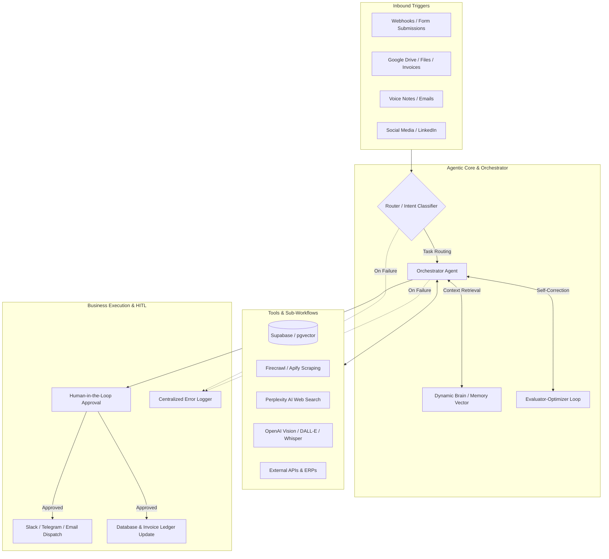

# ⚡ Production-Ready n8n AI Agents & Workflow Automation Suite

> A masterclass collection of **23 enterprise-grade n8n workflows and AI agent architectures** — covering end-to-end RAG systems, orchestrator patterns, multimodal generation, web scraping pipelines, dynamic long-term memory, and human-in-the-loop (HITL) business automation.

---

## 📑 Table of Contents

- [Overview](#-overview)
- [System Architecture](#-system-architecture)
- [Workflow Catalog](#-workflow-catalog)
  - [1. Agentic Design Patterns & Orchestration](#1-agentic-design-patterns--orchestration)
  - [2. Retrieval-Augmented Generation (RAG) & Vector Databases](#2-retrieval-augmented-generation-rag--vector-databases)
  - [3. Enterprise Business Automations](#3-enterprise-business-automations)
  - [4. Data Extraction & Web Intelligence](#4-data-extraction--web-intelligence)
  - [5. Multimodal & Generative Media](#5-multimodal--generative-media)
  - [6. Reliability, Logging & Core Integrations](#6-reliability-logging--core-integrations)
- [Included Guides & Starter Kits](#-included-guides--starter-kits)
- [Quick Start: How to Import & Run](#-quick-start-how-to-import--run)
- [Credentials & Environment Setup](#-credentials--environment-setup)
- [Best Practices for Production](#-best-practices-for-production)
- [Consulting & Contact](#-consulting--contact)

---

## 🌟 Overview

This repository provides ready-to-deploy `.json` workflow blueprints engineered for **n8n** (Cloud & Self-Hosted). These workflows bridge the gap between simple Zapier-style triggers and **state-of-the-art agentic AI systems**, implementing industry patterns proposed by leading AI research teams (orchestrators, evaluators/optimizers, prompt chaining, routing, and dynamic memory brains).

### Key Capabilities

- **Autonomous AI Agents**: Multi-tool calling, memory management, and dynamic routing.
- **Production RAG Systems**: Semantic search, vector embeddings in Supabase/PostgreSQL, document chunking, and contextual answer synthesis.
- **Enterprise Reliability**: Human-in-the-Loop (HITL) approval gates, centralized error logging, and retry logic.
- **Multimodal AI**: Voice transcription (Whisper), AI product video scripting/generation, and DALL-E image generation.
- **Live Web Intelligence**: Real-time web search and scraping via Perplexity, Firecrawl, and Apify actors.

---

## 🏛 System Architecture

---

## 📂 Workflow Catalog

### 1. Agentic Design Patterns & Orchestration

| # | Workflow File | Architecture Pattern | Description |
|---|---|---|---|
| **13** | [`13) First AI Agent.json`](./13)%20First%20AI%20Agent.json) | Autonomous Agent | Foundational AI agent setup with tool binding, chat memory buffer, and prompt engineering. |
| **15** | [`15) Orchestrator Architecture.json`](./15)%20Orchestrator%20Architecture.json) | Supervisor-Worker | Master orchestrator workflow that coordinates specialized sub-agents to complete complex multi-stage tasks. |
| **16** | [`16) Prompt Chaining.json`](./16)%20Prompt%20Chaining.json) | Sequential Chain | Deconstructs complex tasks into structured, sequential prompts where each LLM step feeds verified input into the next. |
| **17** | [`17) Routing.json`](./17)%20Routing.json) | Intent Classifier | Evaluates incoming requests and conditionally routes execution paths to specialized models or handler nodes. |
| **18** | [`18) Parallelization.json`](./18)%20Parallelization.json) | Concurrent Execution | Distributes independent prompt queries or subtasks simultaneously and merges outputs to drastically reduce latency. |
| **19** | [`19) Evaluator Optimizer.json`](./19)%20Evaluator%20Optimizer.json) | Self-Correction Loop | Implements an iterative feedback loop where an Evaluator LLM grades output against criteria and re-prompts the Generator until quality thresholds are met. |
| **20** | [`20) HITL Example Flows.json`](./20)%20HITL%20Example%20Flows.json) | Human-In-The-Loop | Pauses critical or sensitive agent decisions for manual human review and approval before execution proceeds. |
| **22** | [`22) Dynamic Brain.json`](./22)%20Dynamic%20Brain.json) | Long-Term Memory | Persistent memory architecture providing conversational agents with recall over long horizons using vector stores. |

---

### 2. Retrieval-Augmented Generation (RAG) & Vector Databases

| # | Workflow File | Focus Area | Description |
|---|---|---|---|
| **1** | [`1) RAG Pipeline & Chatbot.json`](./1)%20RAG%20Pipeline%20&%20Chatbot.json) | End-to-End RAG | Watches Google Drive folder for documents, computes chunk embeddings, writes to vector store, and provides interactive chatbot retrieval. |
| **11** | [`11) RAG Workflow vs RAG Agent.json`](./11)%20RAG%20Workflow%20vs%20RAG%20Agent.json) | Architectural Comparison | Side-by-side comparison illustrating a deterministic RAG workflow versus an autonomous tool-calling RAG agent. |
| **12** | [`12) Technical Analyst Agent vs Workflow.json`](./12)%20Technical%20Analyst%20Agent%20vs%20Workflow.json) | Financial/Technical Analysis | Demonstrates rigid linear analytical workflows vs adaptive reasoning agents performing deep technical syntheses. |
| **14** | [`14) Supabase Postgres.json`](./14)%20Supabase%20Postgres.json) | Vector & Relational Storage | Connects n8n to Supabase PostgreSQL for vector similarity searches (`pgvector`), user record retrieval, and transaction logging. |

---

### 3. Enterprise Business Automations

| # | Workflow File | Business Domain | Description |
|---|---|---|---|
| **2** | [`2) Customer Support Workflow.json`](./2)%20Customer%20Support%20Workflow.json) | Support Desk | Classifies tickets, matches sentiment, retrieves answers from internal docs, drafts responses, and escalates edge cases. |
| **3** | [`3) LinkedIn Workflow.json`](./3)%20LinkedIn%20Workflow.json) | Content Marketing | Automated research, drafting, formatting, and scheduling of high-engagement LinkedIn posts with brand voice alignment. |
| **4** | [`4) Invoice Workflow.json`](./4)%20Invoice%20Workflow.json) | Finance & Accounting | Ingests PDF invoices, parses structured vendor/pricing data using LLM extraction, validates totals, and writes to accounting ledgers. |
| **23** | [`23) Voice Email Agent.json`](./23)%20Voice%20Email%20Agent.json) | Executive Productivity | Transcribes incoming voice notes via Whisper, identifies action items, drafts professional email responses, and presents drafts for confirmation. |

---

### 4. Data Extraction & Web Intelligence

| # | Workflow File | Service / Tool | Description |
|---|---|---|---|
| **6** | [`6) Perplexity.json`](./6)%20Perplexity.json) | Real-time Search | Leverages Perplexity Sonar API for up-to-the-minute web research, fact-checking, and cited summaries. |
| **7** | [`7) Firecrawl Extract Template.json`](./7)%20Firecrawl%20Extract%20Template.json) | Structured Scraping | Converts raw, dynamic URLs into clean, LLM-ready markdown or targeted JSON schemas using Firecrawl. |
| **8** | [`8) Apify.json`](./8)%20Apify.json) | Scalable Web Scraping | Runs and monitors Apify actors to harvest social media feeds, ecommerce listings, and directories at scale. |

---

### 5. Multimodal & Generative Media

| # | Workflow File | Media Type | Description |
|---|---|---|---|
| **9** | [`9) OpenAI Image Gen.json`](./9)%20OpenAI%20Image%20Gen.json) | AI Image Generation | Generates image assets using DALL-E 3 based on dynamic prompt crafting, resizing, and cloud file storage delivery. |
| **10** | [`10) Product Videos.json`](./10)%20Product%20Videos.json) | Video Production Pipeline | Automates e-commerce video creation: generates scripts, voiceovers, scene prompts, and renders product showcase clips. |

---

### 6. Reliability, Logging & Core Integrations

| # | Workflow File | Operational Focus | Description |
|---|---|---|---|
| **5** | [`5) API Calls in n8n.json`](./5)%20API%20Calls%20in%20n8n.json) | HTTP & Webhooks | Best-practice patterns for handling pagination, rate limiting, authentication headers, and JSON error parsing. |
| **21** | [`21) Error Logger.json`](./21)%20Error%20Logger.json) | Observability & Monitoring | Centralized error catcher trigger that captures failure stack traces across sub-workflows and sends rich alert notifications. |

---

## 📚 Included Guides & Starter Kits

This repository also includes comprehensive reference documentation located in the root directory:

- 📘 **[`The Ultimate n8n Starter Kit.pdf`](./The%20Ultimate%20n8n%20Starter%20Kit.pdf)**: Complete setup guide, node walkthroughs, expression cheat sheets, and best practices for scaling self-hosted instances.
- 📙 **[`Mastering Reactive Prompting for AI Agents (1).pdf`](./Mastering%20Reactive%20Prompting%20for%20AI%20Agents%20(1).pdf)**: In-depth framework on prompt steering, few-shot guardrails, context compaction, and preventing agent drift.
- 📗 **[`AI Works..pdf`](./AI%20Works..pdf)**: High-level methodology on integrating cognitive agents into real-world business pipelines.

---

## 🚀 Quick Start: How to Import & Run

### Option A: Import via n8n UI (Recommended)

1. Open your n8n dashboard (`http://localhost:5678` or your n8n Cloud URL).
2. Click **Workflows** in the left navigation sidebar.
3. Click the **`+ Add Workflow`** button or the three dots `...` in the top right.
4. Select **Import from File...**
5. Select any `.json` file from this repository.
6. Configure your credentials on the highlighted nodes and click **Save & Activate**.

### Option B: Copy & Paste Workflow JSON

1. Open any `.json` file from this repository in your code editor or GitHub.
2. Select all text (`Ctrl + A` / `Cmd + A`) and copy it (`Ctrl + C` / `Cmd + C`).
3. Open a blank canvas in n8n and press `Ctrl + V` / `Cmd + V`. The entire workflow graph will populate instantly.

---

## 🔑 Credentials & Environment Setup

To run these workflows seamlessly, configure the following credentials inside n8n (**Settings > Credentials**):

| Service | Used In Workflows | Description / Keys Required |
|---|---|---|
| **OpenAI** | 1, 9, 10, 11, 12, 13, 15–20, 22, 23 | API Key (`gpt-4o`, `text-embedding-3-small`, `whisper-1`) |
| **Supabase** | 1, 14, 22 | Database URL, Project Key, Service Role Key (pgvector enabled) |
| **Perplexity** | 6 | Perplexity API Key |
| **Firecrawl** | 7 | Firecrawl API Token |
| **Apify** | 8 | Apify Personal API Token |
| **Google Drive / Gmail** | 1, 4, 23 | OAuth2 Client ID & Secret |
| **Slack / Telegram** | 2, 20, 21 | Webhook URL / Bot Token for alerts & HITL approvals |

> 💡 **Tip:** Always use n8n's built-in credential management or environment variables (`.env`) rather than hardcoding tokens inside function nodes.

---

## 🛡 Best Practices for Production

1. **Sub-Workflow Modularity**: Treat complex flows (like the *Orchestrator Architecture* or *Evaluator Optimizer*) as reusable Sub-Workflows via the **Execute Sub-workflow** node.
2. **Global Error Triggering**: Configure the *`21) Error Logger.json`* as the default Error Workflow in your workflow settings so unexpected failures trigger instant notifications.
3. **Data Privacy & GDPR**: When processing invoices or voice notes containing PII, sanitize prompt variables before transmitting them to external LLM endpoints.
4. **Vector Store Indexing**: Ensure `HNSW` or `IVFFlat` indexes are built on your Supabase vector columns to guarantee sub-second semantic search latency as your document store scales.

---

## 💼 Consulting, Custom Builds & Connect

Looking to implement bespoke AI agents, automate enterprise operations, or build production n8n workflows for your company?

- 🌐 **GitHub**: [@azizrehman-tech](https://github.com/azizrehman-tech)
- 💼 **LinkedIn**: [Aziz Rehman](https://www.linkedin.com/in/aziz-rehman-197143368)
- 📧 **Business Inquiries**: Reach out via [LinkedIn](https://www.linkedin.com/in/aziz-rehman-197143368) or GitHub Issues

---

  Engineered with precision for automated, agentic business futures. If you found this repository helpful, consider starring ⭐ the repository!

